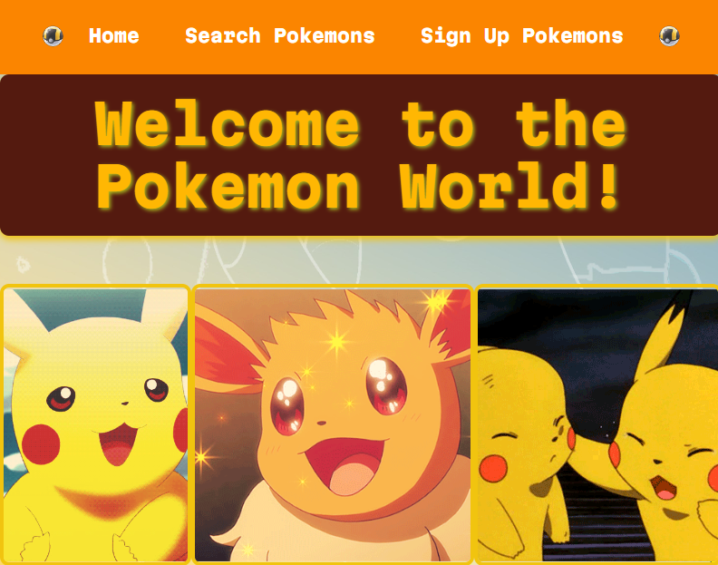
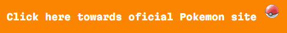
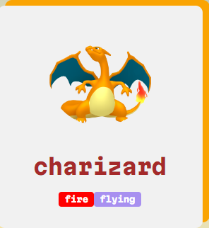
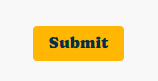

# React-proyect-pokemon

Welcome to Pokemon App fully created with React!

You have 2 options to visualize this project:

1. The simplest one is that you can see the functionality of the project through the following link which will take you to the deployment I made in Netlify and you can navigate directly without installing anything:

    - https://voluble-sorbet-ba416b.netlify.app/

2. If you want to clone the repository and test it yourself and install it on your computer, you can follow the steps below:

    - To start the project once you have cloned the repository (in case you want to test it) you must install the dependencies, use the following command in your terminal:

    - npm run install This will install everything necessary for the project to start!

    - Then use the following command to start the project:

    - npm run dev Now you will be able to browse the following port set in your locale:

    - http://localhost:5173/

3. Once you have the project running or navigating through the link deployed above i will explain how it works:

    - You will get into the Home page which has a Navigation Bar above feel free to click in order to go through the application:

    - 

    - In the footer you can click bellow and it will lead you towards the oficial Pokemon Web Site!

    - 

    - If you get into the Search Pokemons you shall find a text input, feel free to search any pokemon you'd like and you shall see the result :D

    - Here an example:
    - 

    - If you click in to the Pokemon card once you searched it, it will lead you to a detail view where you can find out more information about that pokemon.

4. And last but not least there is a form where you can fill up in order to enter a Pokemon and you will get the pokemon card result once you've submit!

    - 